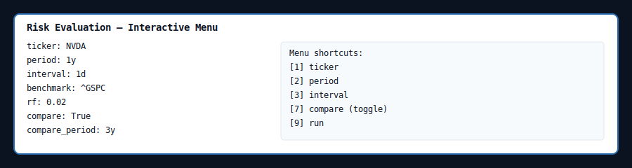

# riskcli — Risk Evaluation CLI

`riskcli` is a small terminal program that downloads price data and prints a compact, human-friendly risk report for a given ticker.

This README shows quick setup, how to run interactively or non-interactively, examples (including compare mode), and troubleshooting tips.

Quick setup
# riskcli — Risk Evaluation CLI

riskcli is a small, fast terminal utility that downloads historical market prices and prints a compact, human-friendly risk report for a given ticker.

This repository contains a lightweight Python package with:
- A CLI entrypoint (`python -m riskcli`) supporting non-interactive and interactive modes
- Risk and performance metrics (Sharpe, Sortino, Beta, Alpha, Max Drawdown, VaR/CVaR, etc.)
- Compare mode to show two windows (side-by-side on wide terminals)
- Export to JSON/CSV and a small unit test suite

Short highlights
----------------
- Uses yfinance for data retrieval
- Renders reports with Rich for a readable terminal experience
- Minimal dependencies and test-driven implementation

Installation
------------
Create and activate a Python virtual environment, then install dependencies:

```bash
python -m venv .venv
source .venv/bin/activate
pip install -r requirements.txt
```

Run tests:

```bash
python -m pytest -q
```

Quick usage
-----------
Non-interactive example:

```bash
python -m riskcli AAPL --period 1y --interval 1d --benchmark ^GSPC --rf 0.02
```

Interactive (menu):

```bash
python -m riskcli
# follow interactive prompts; use numeric shortcuts 1..9
```

Interactive menu details
------------------------
When you run `python -m riskcli` without a ticker the program opens an interactive panel. The current state appears inside a boxed "Risk Evaluation" panel. Shortcuts are numeric and shown on separate lines for clarity.

Default numeric shortcuts (interactive menu):

- [1] ticker — set the ticker symbol (e.g. AAPL)
- [2] period — set the yfinance period (e.g. 1y)
- [3] interval — set data interval (e.g. 1d)
- [4] benchmark — set benchmark ticker for beta (default ^GSPC)
- [5] rf — set annual risk-free rate (accepts 0.02, 2% or 2 -> normalized to 0.02)
- [6] export — set an export path (.json or .csv)
- [7] compare — toggle compare mode on/off
- [8] compare_period — set the second period used in compare mode (e.g. 3y)
- [9] run — fetch data and display the report
- [0] quit — exit the menu

When you toggle compare ([7]) the state reflects it; set the `compare_period` with [8] before running.

Example interactive menu screenshot:



Compare mode (side-by-side when wide):

```bash
python -m riskcli SPY --period 1y --compare --compare-period 3y
```

Options
-------
- `--period` — yfinance period strings: 1mo,3mo,6mo,1y,2y,5y,10y,ytd,max (default: `1y`)
- `--interval` — data interval (e.g. `1d`) (default: `1d`)
- `--benchmark` — benchmark ticker for beta (default: `^GSPC`)
- `--rf` — annual risk-free rate (accepts `0.02`, `2%`, or `2` → normalized to `0.02`)
- `--export` — write metrics/context to `.json` or `.csv`

Formatting notes
----------------
- Unitless ratios (Sharpe, Sortino, Beta, Calmar) are displayed as plain numbers (e.g., `1.234`)
- Percent metrics (Annual Return, Vol, Alpha, VaR, CVaR, Max Drawdown) are shown as percentages
- R² is displayed as a percentage (e.g., `72.35%`)

Network / rate limits
---------------------
The CLI uses yfinance, which may rate-limit frequent requests. If you see "Too Many Requests" when running interactively, try again later or use fewer fetches. Consider enabling a cache or adding a simple retry/backoff if you expect to run many interactive queries.

Quick retry/backoff approach (example):

1. On a 429/Too Many Requests response, wait a small amount of time (e.g., 1-3 seconds) and retry. Increase wait time with each successive retry (exponential backoff).
2. Cache recent downloads (per ticker+period+interval) for a short time during an interactive session to avoid repeated calls when testing.

If you want, I can add a simple in-memory cache and a 3-attempt exponential backoff to the fetch path to reduce rate-limit failures during interactive use.

Design decisions / safety
------------------------
- Annualization uses 252 trading days.
- VaR/CVaR use a simple historical estimate and intentionally return `—` for small samples (<100 daily returns) to avoid misleading tail estimates.
- The CLI accepts flexible RF inputs but converts them once to a daily rate in the metrics code as:

```
rf_daily = (1 + rf_annual) ** (1/252) - 1
```

Development notes
-----------------
- Source is under `riskcli/`.
- Unit tests live in `tests/` and use synthetic data (no network calls).

Publishing
----------
Before publishing to GitHub:

1. Remove any local virtual environments from the repository (this repo now ignores common venv names via `.gitignore`).
2. Add a short project description and topics on GitHub to make it discoverable.
3. Optionally add a small CI workflow (GitHub Actions) to run `pytest` on push.

Contributing
------------
Contributions welcome. Open issues for bugs or feature requests. If you submit code, please include tests and keep changes small and focused.

License
-------
This project is licensed under the MIT License (see `LICENSE`).

Contact
-------
If you want help adding CI, packaging to PyPI, or additional metrics (rolling windows, EWMA volatility, more export options), say which feature and I will implement it.
