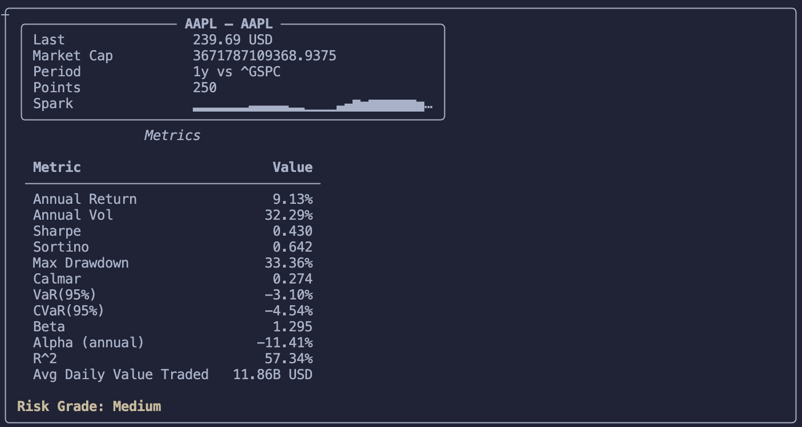

# riskcli — Risk Evaluation CLI

[](https://www.python.org/)
[](LICENSE)
[](#)

> Production-minded terminal tool that downloads adjusted market prices and prints a compact, human-friendly risk report for a given ticker.

<p align="center">
	
</p>

Summary
-------

riskcli is a lightweight Python CLI that fetches historical price series (via `yfinance`), computes standard risk and performance metrics, and renders a readable terminal report with `rich`.

Key features
------------
- Clean terminal reports (summary panel + metrics table + simple risk grade)
- Core metrics: annual return, annual vol, Sharpe, Sortino, Max Drawdown, Calmar, VaR/CVaR, Beta/Alpha/R²
- Interactive menu with numeric shortcuts and a compare mode (two periods side-by-side)
- Export metrics to JSON or CSV
- Small unit test suite (no network calls)

Quick links
-----------
- Source: `riskcli/`
- Tests: `tests/`
- Docs / screenshot: `docs/screenshot.svg`

Requirements
------------
- Python 3.11+
- See `requirements.txt` for full dependency list (pandas, numpy, yfinance, rich, pytest)

Installation
------------
Create a virtual environment and install dependencies:

```bash
python -m venv .venv
source .venv/bin/activate
pip install -r requirements.txt
```

Run tests:

```bash
python -m pytest -q
```

Usage
-----
Non-interactive (quick report):

```bash
python -m riskcli AAPL --period 1y --interval 1d --benchmark ^GSPC --rf 0.02
```

Interactive menu:

```bash
python -m riskcli
```

Interactive menu details
------------------------
When started without a ticker the CLI opens a boxed interactive panel showing the current state (ticker, period, interval, rf, compare, etc.). Shortcuts are numeric and shown on separate lines for clarity.

Default numeric shortcuts (interactive menu):

- [1] ticker — set the ticker (e.g. AAPL)
- [2] period — set the yfinance period (e.g. 1y)
- [3] interval — set data interval (e.g. 1d)
- [4] benchmark — set benchmark ticker for beta (default `^GSPC`)
- [5] rf — set annual risk-free rate (accepts `0.02`, `2%`, or `2` → normalized to `0.02`)
- [6] export — set an export path (`.json` or `.csv`)
- [7] compare — toggle compare mode on/off
- [8] compare_period — set the second period used in compare mode (e.g. `3y`)
- [9] run — fetch data and display the report
- [0] quit — exit the menu

Compare mode
------------
Set `compare` to `True` in the interactive menu or pass `--compare --compare-period 3y` on the CLI to display two period windows side-by-side when the terminal is wide.

Risk-free handling & formatting
--------------------------------
- `--rf` accepts decimal (0.03), percent strings (3%), or shorthand integers (3 -> 0.03). The CLI normalizes this once and `metrics` converts to a daily rate via:

```py
rf_daily = (1 + rf_annual) ** (1/252) - 1
```

- Unitless ratios (Sharpe, Sortino, Beta, Calmar) are shown as plain numbers. Percent metrics and R² are shown as percentages.

Network resilience (rate limits)
-------------------------------
The CLI uses `yfinance` and may encounter remote rate-limits. To reduce failures the fetch path includes:

- A small in-memory cache (300s TTL) per `(ticker, period, interval)` during interactive sessions.
- A 3-attempt exponential backoff with jitter for transient failures.


Export
------
Use `--export out.json` or `--export out.csv` to save computed metrics and contextual fields for further analysis.

Project structure
-----------------
```
./
├── docs/                  # screenshots and small assets
├── riskcli/               # package source
├── tests/                 # unit tests (no network)
├── requirements.txt
├── README.md
└── LICENSE
```

Development notes
-----------------
- Keep `yfinance` network calls isolated for easier testing.
- Add tests for numeric formatting and metric edge-cases.


## Contributing

Here's how to get started:

1. **Fork the repository**
2. **Create a feature branch**: `git checkout -b feature/amazing-feature`
3. **Make changes and test thoroughly**
4. **Commit with clear messages**: `git commit -m 'Add amazing feature'`
5. **Push to branch**: `git push origin feature/amazing-feature`
6. **Create Pull Request**


## 👤 Author

**Your Name**
- GitHub: [@designed7000](https://github.com/designed7000)
- LinkedIn: [Alex_Chortis](https://www.linkedin.com/in/alexandros-c-225804103/)
- Email: alexander.tux@gmail.com


License
-------
This project is licensed under the MIT License (see `LICENSE`).
