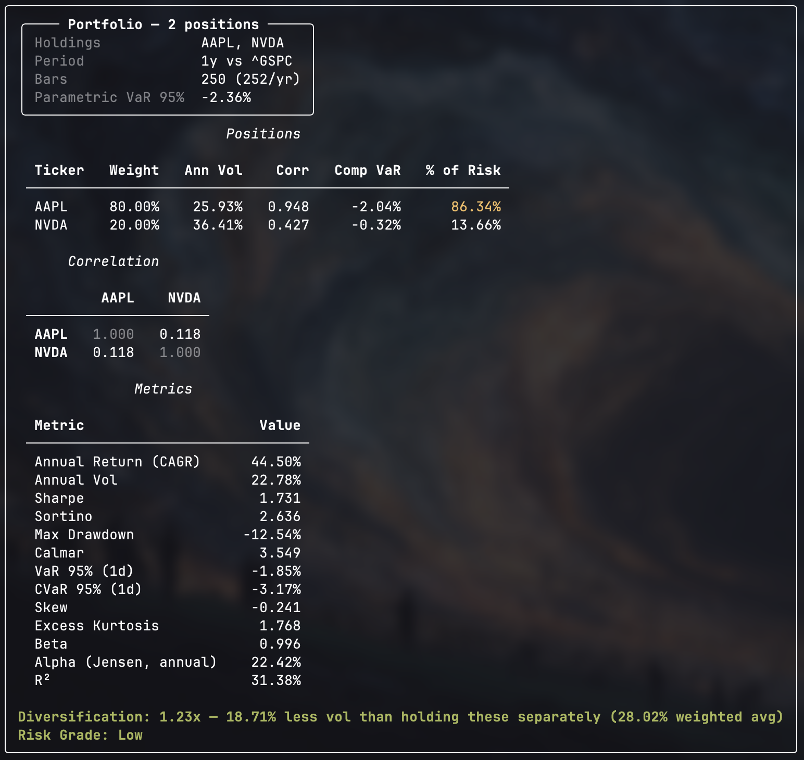

# riskcli — Risk Evaluation CLI

[](https://github.com/designed7000/Risk_Cli/actions/workflows/tests.yml)
[](https://www.python.org/)
[](LICENSE)

> A terminal tool that downloads adjusted market prices and prints a compact risk report for a ticker.

<p align="center">
	
</p>

## Summary

`riskcli` fetches historical prices via `yfinance`, computes standard risk and
performance metrics, and renders them with `rich`. The metric layer is pure
pandas/numpy with no network, so the formulas are unit-tested against
hand-derived expected values rather than against their own output.

## Features

- Summary panel, metrics table, and a coarse Low/Medium/High risk grade
- Annual return (CAGR), annual vol, Sharpe, Sortino, max drawdown, Calmar,
  historical VaR/CVaR, skew, excess kurtosis, CAPM beta / Jensen's alpha / R²
- Annualization inferred from the bar interval, so `1wk`, `1h` and 24/7
  crypto tapes are all correct
- **Portfolio mode**: correlation matrix, diversification ratio, and per-position
  risk attribution (component VaR and % of risk, which are not the weights)
- Interactive menu with numeric shortcuts and a two-period compare mode
- JSON / CSV export
- Test suite runs offline

## Install

One command, no clone. Either tool installs `riskcli` onto your PATH in its
own isolated environment:

```bash
uv tool install git+https://github.com/designed7000/Risk_Cli
```

```bash
pipx install git+https://github.com/designed7000/Risk_Cli
```

To try it without installing anything at all:

```bash
uvx --from git+https://github.com/designed7000/Risk_Cli riskcli AAPL
```

From a checkout, for development:

```bash
python -m venv .venv && source .venv/bin/activate
pip install -e ".[dev]"
```

## Usage

```bash
riskcli AAPL --period 1y --benchmark ^GSPC --rf 0.04
```

Give it more than one ticker and it reports the **portfolio** instead:

```bash
riskcli AAPL MSFT TLT                       # equal weights
riskcli AAPL=0.4 MSFT=0.4 TLT=0.2 --rf 4%   # explicit weights
riskcli SPY=1.3 TLT=-0.3                    # shorts are allowed
```

Without a ticker it opens the interactive menu:

```bash
riskcli
```

From a checkout without installing, `python -m riskcli AAPL` works the same way.

| Flag | Default | Notes |
| --- | --- | --- |
| `--period` | `1y` | `1mo`, `3mo`, `6mo`, `1y`, `2y`, `5y`, `10y`, `ytd`, `max` |
| `--interval` | `1d` | `1d`, `1wk`, `1mo`, `1h` — annualization follows this |
| `--benchmark` | `^GSPC` | Used for beta/alpha/R². Optional; skipped if it fails |
| `--rf` | `0.0` | Annual risk-free. `0.04`, `4` and `4%` all mean 4% |
| `--export` | — | `.json` or `.csv`. With `--compare`, exports `--period` only |
| `--compare` | off | Adds `--compare-period` (default `3y`) side by side. Single-name only |

`--rf` reads a bare magnitude of 1 or more as a percentage, so `4` is 4% and
not 400%, and `-3` is -3%. Below 1 the value is already a decimal, so `0.04`
is 4% and `0.5` is 50%. Anything unparseable is a usage error rather than a
silent zero.

## Portfolio mode

Portfolio risk is not the weighted average of position risk, and two numbers in
this view exist to make that concrete:

**Diversification ratio** — weighted-average volatility divided by actual
portfolio volatility. `1.00x` means the holdings move together and you own one
bet spread across several tickers; higher means the correlations are doing work.

**Risk attribution** — the `% of Risk` column is each position's *contribution*
to portfolio volatility, which is not its weight. Two consequences that a weight
column can never show you:

- A concentrated position is superlinear in risk. In a two-asset uncorrelated
  book, a 90% weight carries **98.8%** of the risk.
- A hedge contributes **negative** risk. A bond leg in an equity book routinely
  shows a negative `% of Risk` — it is removing volatility, not adding it. That
  is the number you want when deciding what to cut.

Contributions use Euler decomposition on the covariance matrix, so they sum
exactly to portfolio volatility rather than approximately.

Exports: `.json` carries the full structure (positions, correlation matrix,
portfolio metrics); `.csv` is the position table plus a `PORTFOLIO` total row.

## Metric conventions

These are the choices behind the numbers. They are the conventional ones, but
they are worth stating because implementations differ:

- **Returns** are simple (not log) and computed from adjusted closes, so
  dividends are included. Non-positive prices are dropped as bad ticks — a
  zero mid-series makes the next bar an infinite return, which silently turns
  the compounded return into `NaN`.
- **Annualization** uses the bar frequency inferred from the index: 252 for
  daily bars on an exchange, 365.25 for a 24/7 tape, 52 weekly, 12 monthly,
  and `trading-days × bars-per-session` for intraday. A fixed 252 would
  overstate intraday vol by roughly `√6.5`, and understate a coin's CAGR by
  about a third.
- **Annual return** is geometric (CAGR). **Sharpe** and **Sortino** use the
  *arithmetic* mean excess return in the numerator — the standard convention,
  and deliberately not the same number as the CAGR.
- **Risk-free** is converted per bar as `(1 + rf) ** (1 / periods_per_year) - 1`.
- **Sortino** divides by the lower partial standard deviation below the
  risk-free MAR, not by the stdev of the negative returns only.
- **Max drawdown** is stored as a positive magnitude and displayed negative.
- **VaR/CVaR** are single-bar historical (non-parametric) figures at 95%,
  shown as negative returns. They are `NaN` below 100 observations rather than
  reported from a sample too small to mean anything — so a `3mo` daily fetch,
  or a `1y` weekly one, will dash them out.
- **Alpha** is Jensen's alpha: the intercept of excess asset returns regressed
  on excess benchmark returns, scaled by the periods in a year. It is net of
  `--rf`. Scaled rather than compounded, so it annualizes the same way the
  Sharpe numerator does and stays stable at intraday frequencies.
- **Beta, alpha and R²** need at least 30 overlapping bars. Two points define
  a line exactly, so a shorter overlap would report R² = 100%.
- **Average value traded** uses unadjusted close × volume, and is per *bar* —
  at a weekly interval it is a weekly figure, not a daily one. It is also
  per-instrument, so the portfolio view omits it rather than printing a
  meaningless zero.

For portfolios specifically:

- **Weights are constant and rebalanced every bar.** A buy-and-hold book drifts
  away from its starting weights; this does not model that drift.
- **Weights are normalized to sum to 1**, so `A=2 B=2` and `A=0.5 B=0.5` are the
  same portfolio. The normalized weights are printed back so nothing is hidden.
- **Holdings are aligned on the dates they all share.** A short-history holding
  truncates the whole sample, and the bar count is shown so you can see it.
- **Component VaR is parametric** (normal, zero drift) so it decomposes
  additively; the headline VaR stays historical, matching the single-name
  report. The two disagree when returns are fat-tailed — which is why both are
  shown rather than one.

The risk grade is a deliberately coarse heuristic over vol, drawdown and tail
loss — a conversation starter, not a model output.

## Development

```bash
pytest
```

The suite covers the metric formulas against hand-computed values, the risk
grade, the formatting helpers, the rendered report, the cache/retry/timezone
behaviour of the data layer, and the CLI and its interactive menu end to end
with the fetch layer stubbed. Nothing touches the network.

```
./
├── .github/workflows/    # CI
├── docs/                 # screenshots
├── riskcli/              # package source
│   ├── cli.py            # argument parsing, interactive menu, export
│   ├── data.py           # yfinance fetch, cache, retry, metadata
│   ├── metrics.py        # pure metric functions (no I/O)
│   ├── portfolio.py      # aggregation, correlation, risk attribution (no I/O)
│   ├── report.py         # rich rendering and the risk grade
│   └── utils.py          # number formatting, sparkline
└── tests/
```

Known limits, stated plainly: prices come from `yfinance`, which is a scraped
and rate-limited source, not an exchange feed. Because of that the fetch layer
is deliberately frugal — one request per symbol, with the name/currency lookup
(two further requests) skipped wherever the caller discards it, and a rate limit
failing immediately rather than being retried into a deeper cooldown. If you do
get throttled, wait a few minutes; the limit is not published and retrying
extends it. The cache is per-process, so it helps repeat runs inside the
interactive menu and nothing else. Beta is a
single-factor OLS estimate on overlapping bars with no correction for stale
prices, so it is noisy for illiquid names — and comparing a non-US ticker
against the default `^GSPC` still matches two different trading calendars by
date. Returns are differenced before the asset and benchmark are aligned, so a
missing benchmark session biases beta slightly. The annualized figures have no
minimum sample: a `1mo` fetch will happily report a CAGR extrapolated from
twenty bars, so read them next to the bar count in the summary panel. The
covariance matrix behind the risk attribution is a plain sample estimate over
the whole window — it is not shrunk, not exponentially weighted, and it assumes
the correlations were stable across the period, which in a crisis they are not.

## Contributing

1. Fork the repository
2. Create a feature branch: `git checkout -b feature/amazing-feature`
3. Make changes, add tests, run `pytest`
4. Commit and push, then open a pull request

## Author

**Alexandros Chortis**
- GitHub: [@designed7000](https://github.com/designed7000)
- LinkedIn: [alexandros-c](https://www.linkedin.com/in/alexandros-c-225804103/)

## License

MIT — see [LICENSE](LICENSE).
