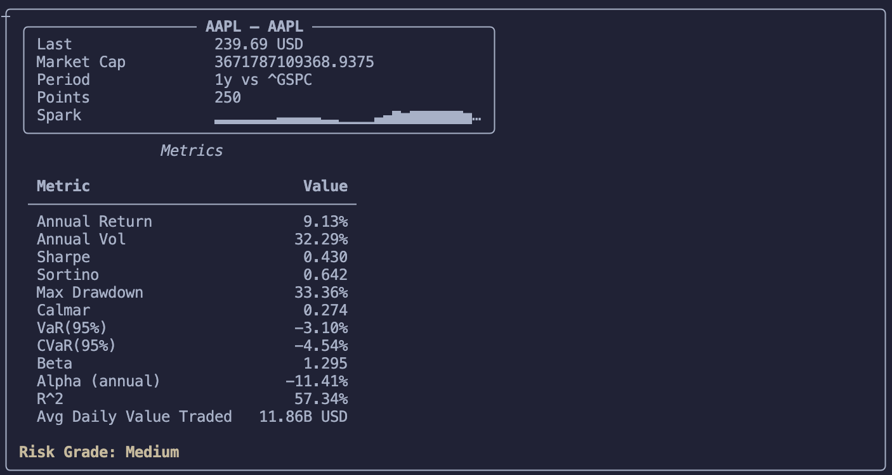

# riskcli — Risk Evaluation CLI

[](https://github.com/designed7000/Risk_Cli/actions/workflows/tests.yml)
[](https://www.python.org/)
[](LICENSE)

> A terminal tool that downloads adjusted market prices and prints a compact risk report for a ticker.

<p align="center">
	
</p>

## Summary

`riskcli` fetches historical prices via `yfinance`, computes standard risk and
performance metrics, and renders them with `rich`. The metric layer is pure
pandas/numpy with no network, so every number is unit-tested against a
hand-derived expected value.

## Features

- Summary panel, metrics table, and a coarse Low/Medium/High risk grade
- Annual return (CAGR), annual vol, Sharpe, Sortino, max drawdown, Calmar,
  historical VaR/CVaR, skew, excess kurtosis, CAPM beta / Jensen's alpha / R²
- Annualization inferred from the bar interval, so `1wk` and `1h` are correct
- Interactive menu with numeric shortcuts and a two-period compare mode
- JSON / CSV export
- Test suite runs offline

## Install

One command, no clone. Either tool installs `riskcli` onto your PATH in its
own isolated environment:

```bash
uv tool install git+https://github.com/designed7000/Risk_Cli
```

```bash
pipx install git+https://github.com/designed7000/Risk_Cli
```

To try it without installing anything at all:

```bash
uvx --from git+https://github.com/designed7000/Risk_Cli riskcli AAPL
```

From a checkout, for development:

```bash
python -m venv .venv && source .venv/bin/activate
pip install -e ".[dev]"
```

## Usage

```bash
riskcli AAPL --period 1y --benchmark ^GSPC --rf 0.04
```

Without a ticker it opens the interactive menu:

```bash
riskcli
```

From a checkout without installing, `python -m riskcli AAPL` works the same way.

| Flag | Default | Notes |
| --- | --- | --- |
| `--period` | `1y` | `1mo`, `3mo`, `6mo`, `1y`, `2y`, `5y`, `10y`, `ytd`, `max` |
| `--interval` | `1d` | `1d`, `1wk`, `1mo`, `1h` — annualization follows this |
| `--benchmark` | `^GSPC` | Used for beta/alpha/R². Optional; skipped if it fails |
| `--rf` | `0.0` | Annual risk-free. Accepts `0.04`, `4%` or `4` |
| `--export` | — | `.json` or `.csv` |
| `--compare` | off | Adds `--compare-period` (default `3y`) side by side |

## Metric conventions

These are the choices behind the numbers. They are the conventional ones, but
they are worth stating because implementations differ:

- **Returns** are simple (not log) and computed from adjusted closes, so
  dividends are included.
- **Annualization** uses the bar frequency inferred from the index: 252 for
  daily, 52 weekly, 12 monthly, and `252 × bars-per-session` for intraday.
  A fixed 252 would overstate intraday vol by roughly `√6.5`.
- **Annual return** is geometric (CAGR). **Sharpe** and **Sortino** use the
  *arithmetic* mean excess return in the numerator — the standard convention,
  and deliberately not the same number as the CAGR.
- **Risk-free** is converted per bar as `(1 + rf) ** (1 / periods_per_year) - 1`.
- **Sortino** divides by the lower partial standard deviation below the
  risk-free MAR, not by the stdev of the negative returns only.
- **Max drawdown** is stored as a positive magnitude and displayed negative.
- **VaR/CVaR** are single-bar historical (non-parametric) figures at 95%,
  shown as negative returns. They are `NaN` below 100 observations rather than
  reported from a sample too small to mean anything.
- **Alpha** is Jensen's alpha: the intercept of excess asset returns regressed
  on excess benchmark returns, then annualized. It is net of `--rf`.
- **Average value traded** uses unadjusted close × volume.

The risk grade is a deliberately coarse heuristic over vol, drawdown and tail
loss — a conversation starter, not a model output.

## Development

```bash
pytest
```

The suite covers the metric formulas against hand-computed values, the risk
grade, the formatting helpers, the cache/retry/metadata behaviour of the data
layer, and the CLI end to end with the fetch layer stubbed. Nothing touches the
network.

```
./
├── .github/workflows/    # CI
├── docs/                 # screenshots
├── riskcli/              # package source
│   ├── cli.py            # argument parsing, interactive menu, export
│   ├── data.py           # yfinance fetch, cache, retry, metadata
│   ├── metrics.py        # pure metric functions (no I/O)
│   ├── report.py         # rich rendering and the risk grade
│   └── utils.py          # number formatting, sparkline
└── tests/
```

Known limits, stated plainly: prices come from `yfinance`, which is a scraped
and rate-limited source, not an exchange feed. The cache is per-process, so it
helps repeat runs inside the interactive menu and nothing else. Beta is a
single-factor OLS estimate on overlapping bars with no correction for stale
prices, so it is noisy for illiquid names. Single instrument only — there is no
portfolio aggregation yet.

## Contributing

1. Fork the repository
2. Create a feature branch: `git checkout -b feature/amazing-feature`
3. Make changes, add tests, run `pytest`
4. Commit and push, then open a pull request

## Author

**Alexandros Chortis**
- GitHub: [@designed7000](https://github.com/designed7000)
- LinkedIn: [alexandros-c](https://www.linkedin.com/in/alexandros-c-225804103/)

## License

MIT — see [LICENSE](LICENSE).
